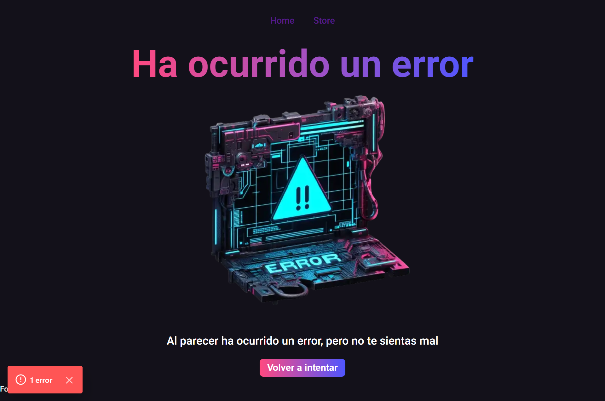
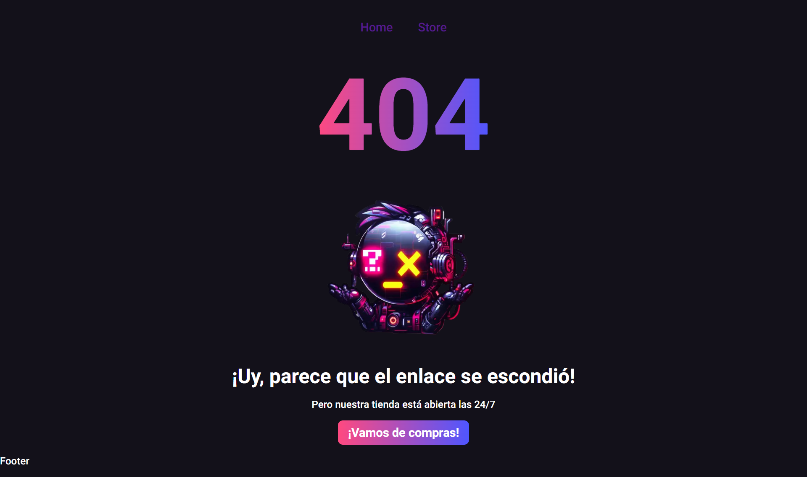

# Next.js Store

Este repositorio contiene el código fuente de una aplicación web de comercio electrónico desarrollada con Next.js. La aplicación consta de dos secciones principales: "Inicio" y "Productos".

## Capturas de Pantalla

### Inicio


En la sección de "Inicio", los usuarios son recibidos con una interfaz atractiva y amigable que destaca las características clave de la tienda. Puede personalizar esta sección según las necesidades específicas de su tienda.

### Productos


La sección de "Productos" muestra una selección de los productos disponibles en la tienda. Cada producto se presenta con una imagen, nombre, precio y cualquier otra información relevante. Los usuarios pueden explorar fácilmente la variedad de productos que ofrece la tienda.

## Funcionalidades adicionales



Esta captura de pantalla muestra un mensaje de error inesperado que puede surgir durante la ejecución de la aplicación. El mensaje de error proporciona información valiosa sobre la naturaleza del problema, lo que facilita la identificación y resolución del mismo.



Esta captura de pantalla muestra un mensaje de 404 para las rutas que no se encuentren.

## Características Principales

- **Next.js**: La aplicación está construida con [Next.js](https://nextjs.org/), un marco de desarrollo de React que facilita la creación de aplicaciones web rápidas y eficientes.

- **Diseño Responsivo**: La interfaz de usuario está diseñada para adaptarse a diferentes tamaños de pantalla, garantizando una experiencia de usuario consistente en dispositivos móviles, tabletas y computadoras de escritorio.

- **Componentes Reutilizables**: El código utiliza componentes reutilizables para mejorar la modularidad y facilitar el mantenimiento.

## Cómo Ejecutar

Siga estos pasos para ejecutar la aplicación en su máquina local:

1. **Clonar el Repositorio:**
   ```bash
   git clone https://github.com/tuusuario/nextjs-store.git
   cd nextjs-store
   ```
2. **Instalar Dependencias:**

   ```bash
   npm install
   ```

3. **Iniciar la Aplicación:**

   ```bash
   npm run dev
   ```

4. **Iniciar la Aplicación:**

   Abra http://localhost:3000 en su navegador para ver la aplicación.

## Contribuir

Si desea contribuir a este proyecto, siga estos pasos:

1. Forkee este repositorio.
2. Cree una nueva rama para su característica (git checkout -b feature/nueva-caracteristica).
3. Haga sus cambios y confirme (git commit -m 'Agrega nueva característica').
4. Envíe las modificaciones (git push origin feature/nueva-caracteristica).
5. Abra una solicitud de extracción.
